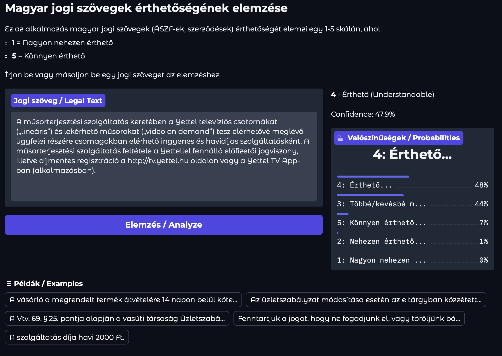

# Legal Text Decoder

 

## Project Details

### Project Information

- **Selected Topic**: Legal Text Decoder
- **Student Name**: Márton Csutora
- **Aiming for +1 Mark**: Yes

### Solution Description

This project implements a **Legal Text Decoder** - a system that analyzes Hungarian legal texts (ÁSZF - Általános Szerződési Feltételek / General Terms and Conditions) and predicts their understandability on a scale of 1-5:

| Score | Hungarian | English |
|-------|-----------|---------|
| 1 | Nagyon nehezen érthető | Very hard to understand |
| 2 | Nehezen érthető | Hard to understand |
| 3 | Többé/kevésbé megértem | Somewhat understandable |
| 4 | Érthető | Understandable |
| 5 | Könnyen érthető | Easy to understand |

#### Model Architecture

The solution uses a **fine-tuned Hungarian BERT model (HuBERT)** for text classification:

- **Base Model**: `SZTAKI-HLT/hubert-base-cc` - A Hungarian BERT model pretrained on a large Hungarian corpus
- **Architecture**: BERT encoder + Classification head (768 → 5 classes) with dropout regularization
- **Loss Function**: **Progressive Weighted Ordinal Loss** - A custom loss combining cross-entropy and ordinal components (see below)
- **Class Weighting**: Balanced class weights to handle label imbalance
- **Regularization**: Dropout (0.3), weight decay (0.05), and partial encoder freezing (first 4 layers)

#### Custom Loss Function

The model uses a **Progressive Weighted Ordinal Loss** that combines two components:

1. **Weighted Cross-Entropy**: Standard classification loss with class weights to handle imbalanced data
2. **Ordinal Cross-Entropy**: Treats labels as ordinal by modeling cumulative probabilities P(Y ≤ k), penalizing predictions that violate ordinal consistency

The key improvement comes from **progressive weighting**: during training, the loss transitions from CE-dominated (80% CE, 20% ordinal) to ordinal-dominated (20% CE, 80% ordinal). This allows the model to:
- **Early training**: Learn to distinguish all classes, especially rare ones (class 1 has only ~3% of samples)
- **Late training**: Refine probability distributions to be ordinal-consistent

This approach addresses the challenge of combining class weighting (which can distort ordinal structure) with ordinal loss (which assumes balanced classes).

#### Training Methodology

1. **Data Preprocessing**: Aggregated and cleaned 3,397 labeled samples from 33 JSON files (Label Studio exports) from 25 different annotators
2. **Stratified Split**: 80% train / 10% validation / 10% test with stratification by label
3. **Training**: Fine-tuning with AdamW optimizer (lr=1e-5), cosine learning rate schedule with warmup, early stopping on validation MAE (patience=5)
4. **Evaluation**: Accuracy, Macro F1, MAE, Cohen's Kappa (quadratic weighted)

#### Results Summary

| Model | Accuracy | Macro F1 | MAE | Kappa |
|-------|----------|----------|-----|-------|
| Baseline (TF-IDF + LogReg) | 0.36 | 0.30 | 0.97 | 0.3325 |
| Baseline (TF-IDF + SVM) | 0.36 | 0.30 | 0.98 | 0.3190 |
| HuBERT + Progressive Ordinal Loss | **0.46** | **0.38** | **0.72** | **0.51** |

The model achieves around a 28% improvement in accuracy and around a 26% reduction in MAE compared to the baselines. The Cohen's Kappa of 0.51 indicates moderate ordinal agreement, which is reasonable given the subjective nature of "understandability" ratings from multiple annotators.

Example classifications can be seen below:

```
"A szerződés létrejöttével a vevő vállalja, hogy a vételárat megfizeti."
Prediction: 5 - Könnyen érthető (Easy to understand)
    Label 1: 0.00%
    Label 2: 0.00%
    Label 3: 0.01%
    Label 4: 4.54%
    Label 5: 95.45%

"A Vtv. 69. § 25. pontja alapján a vasúti társaság Üzletszabályzatának jóváhagyása a Vtv. szerinti va..."
Prediction: 1 - Nagyon nehezen érthető (Very hard to understand)
    Label 1: 99.95%
    Label 2: 0.02%
    Label 3: 0.02%
    Label 4: 0.00%
    Label 5: 0.00%
```

### Extra Credit Justification

This project qualifies for the +1 mark based on:

1. **Complete Pipeline**: Full implementation from data preprocessing to web deployment with Docker containerization
2. **Novel Loss Function**: Custom **Progressive Weighted Ordinal Loss** that:
   - Combines cross-entropy and ordinal loss components
   - Uses progressive scheduling to balance class imbalance handling with ordinal consistency
   - Addresses the inherent tension between class weighting and ordinal structure
3. **Advanced Training Techniques**:
   - Cosine learning rate schedule with linear warmup
   - Early stopping on MAE (appropriate for ordinal regression)
   - Regularization via dropout, weight decay, and partial encoder freezing
4. **ML as a Service**: Gradio-based web interface for interactive text analysis
5. **Comprehensive Evaluation**: Multiple metrics including Cohen's Kappa (quadratic weighted) for ordinal agreement
6. **Multi-source Data Handling**: Robust parsing of Label Studio exports from 25 different annotators with varying JSON formats
7. **Task-optimized Performance**: Focusing on both label accuracy and a low absolute error makes the model function the closest to how the best humans would rank the texts. 

### Data Preparation

The data is collected from Hungarian legal documents (ÁSZF) labeled by multiple students using Label Studio. The data files are located in the `data/` directory, with each student's contributions in separate folders.

**Data Format**: Label Studio JSON export with the following structure:
```json
{
  "data": {"text": "Legal text paragraph..."},
  "annotations": [{
    "result": [{
      "value": {"choices": ["4-Érthető"]},
      "type": "choices"
    }]
  }]
}
```

The preprocessing script (`src/01-data-preprocessing.py`) handles:
- Parsing multiple JSON formats from different annotators
- Extracting text and labels (Hungarian label strings → integers 1-5)
- Removing cancelled annotations and duplicates
- Stratified train/val/test splitting

### Docker Instructions

This project is containerized using Docker with GPU support.

#### Build

```bash
# CPU version
docker build -t legal-text-decoder .

# GPU version (requires NVIDIA Docker runtime)
docker build --target gpu -t legal-text-decoder:gpu .
```

#### Run Full Pipeline

```bash
# Run with data mounted, capture logs (CPU version)
docker run -v $(pwd)/data:/app/data -v $(pwd)/models:/app/models legal-text-decoder > log/run.log 2>&1

# GPU version (requires NVIDIA Container Toolkit)
docker run --gpus all -v $(pwd)/data:/app/data -v $(pwd)/models:/app/models legal-text-decoder:gpu > log/run.log 2>&1
```

> **Note**: For GPU support in Docker, you need the [NVIDIA Container Toolkit](https://docs.nvidia.com/datacenter/cloud-native/container-toolkit/install-guide.html) installed. Alternatively, run training directly on your host machine (see [Local Development](#local-development)).

#### Run Gradio Web Interface

```bash
# Start the web interface on port 7860
docker run -p 7860:7860 -v $(pwd)/data:/app/data -v $(pwd)/models:/app/models \
    legal-text-decoder python src/app.py
```

Then open http://localhost:7860 in your browser.

#### Run Individual Scripts

```bash
# Data preprocessing only
docker run -v $(pwd)/data:/app/data legal-text-decoder python src/01-data-preprocessing.py

# Training only
docker run -v $(pwd)/data:/app/data -v $(pwd)/models:/app/models \
    legal-text-decoder python src/02-training.py

# Evaluation only
docker run -v $(pwd)/data:/app/data -v $(pwd)/models:/app/models \
    legal-text-decoder python src/03-evaluation.py

# Inference on examples
docker run -v $(pwd)/models:/app/models legal-text-decoder python src/04-inference.py
```

### File Structure and Functions

```
legal-text-decoder/
├── src/
│   ├── 01-data-preprocessing.py  # Data loading, cleaning, and splitting
│   ├── 02-training.py            # Model training with ordinal loss
│   ├── 03-evaluation.py          # Comprehensive model evaluation
│   ├── 04-inference.py           # Inference on new texts
│   ├── app.py                    # Gradio web application
│   ├── baseline.py               # TF-IDF + LogReg baseline model
│   ├── config.py                 # Hyperparameters and paths
│   ├── dataset.py                # PyTorch Dataset class
│   ├── model.py                  # HuBERT classifier + ordinal loss
│   └── utils.py                  # Logging utilities
│
├── notebook/
│   ├── 01-data-exploration.ipynb # EDA and visualization
│   └── 02-label-analysis.ipynb   # Label distribution analysis
│
├── data/
│   ├── <student_id>/             # Raw Label Studio exports
│   └── processed/                # Preprocessed train/val/test splits
│       ├── train.json
│       ├── val.json
│       ├── test.json
│       └── all_data.json
│
├── models/
│   ├── best_model.pth            # Best trained model checkpoint
│   ├── baseline_model.joblib     # Baseline model
│   └── training_history.json     # Training metrics history
│
├── log/
│   └── run.log                   # Pipeline execution log
│
├── Dockerfile                    # Container configuration
├── requirements.txt              # Python dependencies
├── run.sh                        # Full pipeline script
├── PLAN.md                       # Implementation plan
└── README.md                     # This file
```

### Configuration

Key hyperparameters in `src/config.py`:

| Parameter | Value | Description |
|-----------|-------|-------------|
| MODEL_NAME | SZTAKI-HLT/hubert-base-cc | Hungarian BERT model |
| NUM_LABELS | 5 | Understandability classes |
| MAX_LENGTH | 512 | Max token sequence length |
| BATCH_SIZE | 8 | Training batch size |
| LEARNING_RATE | 1e-5 | AdamW learning rate |
| WEIGHT_DECAY | 0.05 | L2 regularization |
| DROPOUT | 0.3 | Dropout rate for classification head |
| FREEZE_ENCODER_LAYERS | 4 | Freeze first N transformer layers |
| EPOCHS | 20 | Maximum training epochs |
| EARLY_STOPPING_PATIENCE | 5 | Early stopping patience (on MAE) |
| LOSS_TYPE | ordinal_cross_entropy | Progressive weighted ordinal loss |

### Requirements

- Python 3.10+
- PyTorch 2.3+
- Transformers 4.40+
- CUDA 12.1+ (for GPU training)
- See `requirements.txt` for full dependencies

### Local Development

#### Setup

```bash
# Create virtual environment
python3 -m venv venv
source venv/bin/activate

# Install dependencies
pip install -r requirements.txt

# Or, if you are on a system with nix available, you can just run the python commands in a nix-shell with the proper dependencies:
NIXPKGS_ALLOW_UNFREE=1 nix-shell -p python312 python312Packages.torchWithCuda python312Packages.transformers python312Packages.scikit-learn python312Packages.tqdm python312Packages.numpy python312Packages.pandas python312Packages.joblib python312Packages.gradio
```

#### Running the Pipeline

```bash
# Run full pipeline
bash run.sh

# Or run individual scripts:
python src/01-data-preprocessing.py  # Data preprocessing
python src/baseline.py               # Baseline model
python src/02-training.py            # Train HuBERT model
python src/03-evaluation.py          # Evaluate model
python src/04-inference.py           # Run inference examples
python src/app.py                    # Start Gradio web interface
```

#### Running the Web Interface

```bash
python src/app.py
# Open http://localhost:7860 in your browser
```
